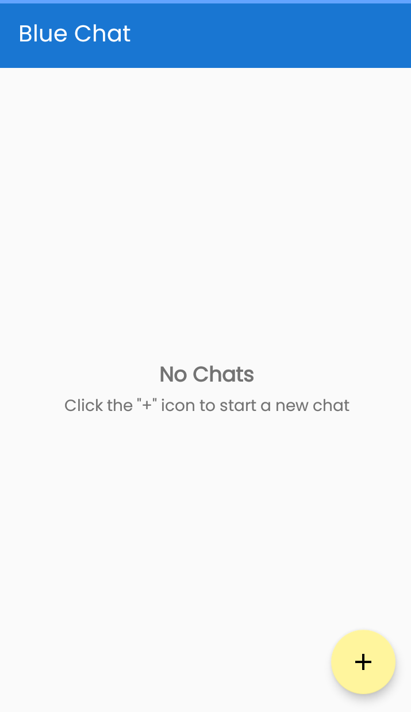
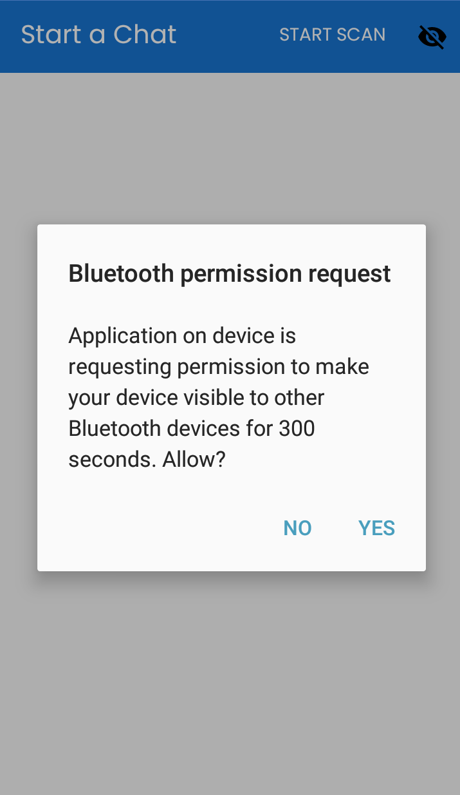
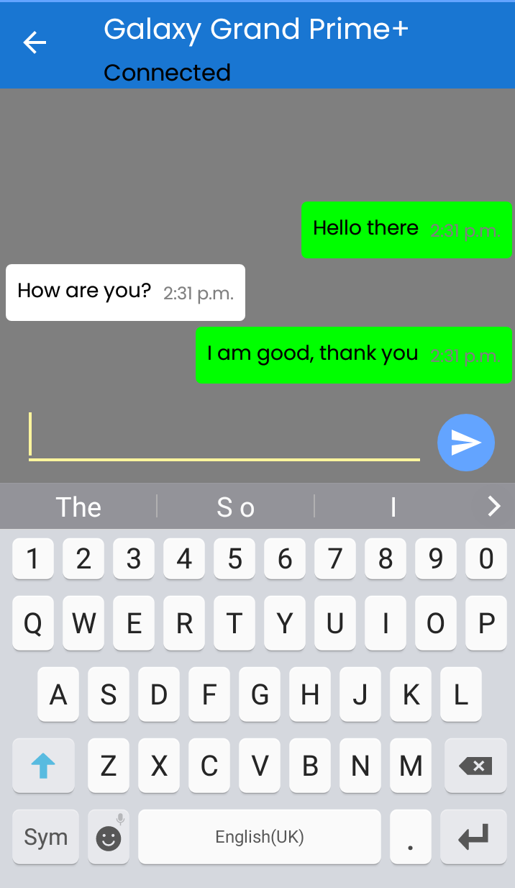
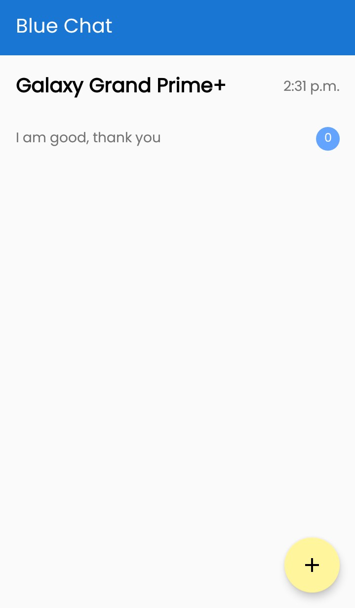

# BluetoothChat
BluetoothChat is a modified version of the BlueChat project (https://github.com/DavidGrath/BlueChat) that has been updated to work with Android SDK 33. It is a chat app that uses Bluetooth for communication between devices.
This project was created as a learning exercise to explore the implementation of a chat app using Bluetooth technology. It draws inspiration from the Google Sample for Bluetooth communication.

## Technologies Used
 - Android Bluetooth SDKs
 - Jetpack components like MVVM and LiveData  

A notable aspect of this project is the use of Clean Architecture principles, which have been applied to improve the overall structure and maintainability of the codebase. However, please note that the app does not utilize Room for data persistence; all data is stored in memory.
BluetoothChat aims to provide a simple and efficient way to communicate between devices using Bluetooth, while serving as a practical example of implementing Clean Architecture in an Android app.

## Screenshots
### Home No Chats

### Device Search

### Found Phone

### The Chat Feature

### Home with chats

